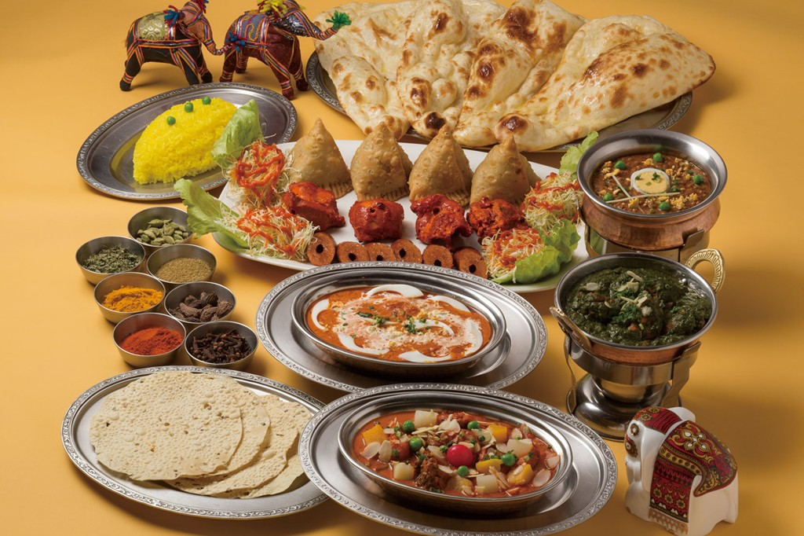

# Indian Food Eda

Welcome to the Indian Food Eda repository! This project is all about celebrating the vibrant and diverse world of Indian cuisine. Whether you're a seasoned chef or a culinary novice, we're here to inspire and guide you on a delectable adventure through the rich flavors of India.

## About

Indian Food Eda is your culinary companion for exploring the wonders of Indian food. We curate a wide array of authentic Indian recipes, from the spicy delights of the North to the subtle flavors of the South. Our mission is to share the stories, techniques, and traditions behind each dish, connecting you with the culture and heritage of India.

## Features

- A collection of authentic Indian recipes from various regions.
- Cooking tips, techniques, and insights into Indian spices and ingredients.
- A journey through the diversity of Indian cuisine, from street food to traditional dishes.
- Regular updates to keep your taste buds excited.

## Getting Started

1. Clone this repository to your local machine.
2. Explore the recipes and cooking tips in the project folders.
3. Start your culinary adventure by trying out some of the delicious Indian dishes.

## Contributing

We welcome contributions from the community! If you have your own favorite Indian recipes, cooking tips, or cultural insights to share, please feel free to contribute to this project. Follow our [contribution guidelines](CONTRIBUTING.md) to get started.

## Contributors

- Vivek Kumar (Team Leader) - GitHub: [Bholuvivek](https://github.com/Bholuvivek)
- Raviranjan Kumar (Team Member 1) - GitHub: [Raviranjankumar788](https://github.com/Raviranjankumar788)
- Azharuddin Ansari (Team Member 2) - GitHub: [Azharuddin91284](https://github.com/Azharuddin91284)
- MD Ajbullah Mansuri (Team Member 3) - GitHub: [MdAjbullah](https://github.com/MdAjbullah)

## License

This project is licensed under the [MIT License](LICENSE). Feel free to use, modify, and distribute the code and content in accordance with the license terms.

## Contact

Have questions, suggestions, or just want to chat about Indian cuisine? Reach out to us:

- Email: [jctboy@gmail.com](mailto:viveksinghpihuli0a@gmail.com)

## Follow Us

Stay updated with our latest recipes and culinary adventures:

- YouTube: [Vivek](https://youtu.be/ZNWMyDzL8AE?si=w68sBV8yD_MJk2I2)

## Enjoy Your Culinary Journey

Thank you for choosing Indian Food Eda as your culinary companion. We hope you enjoy your time here and savor the incredible flavors of India. Happy cooking!

